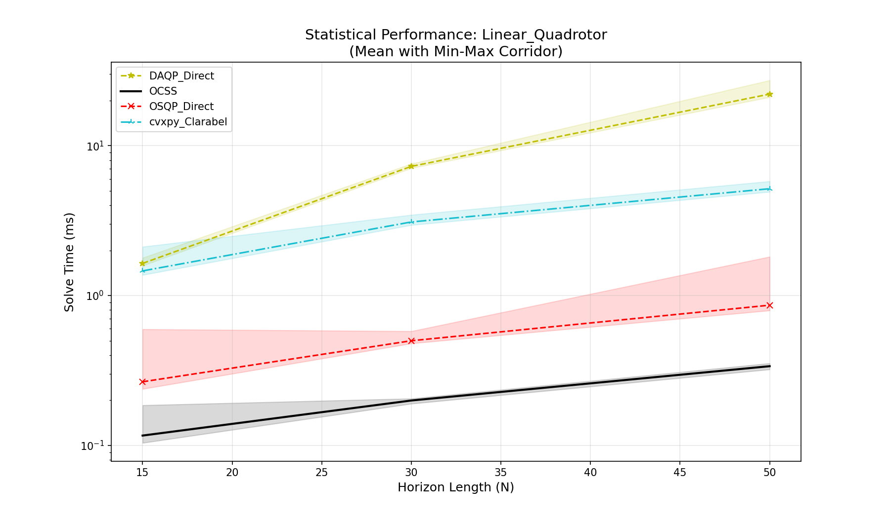
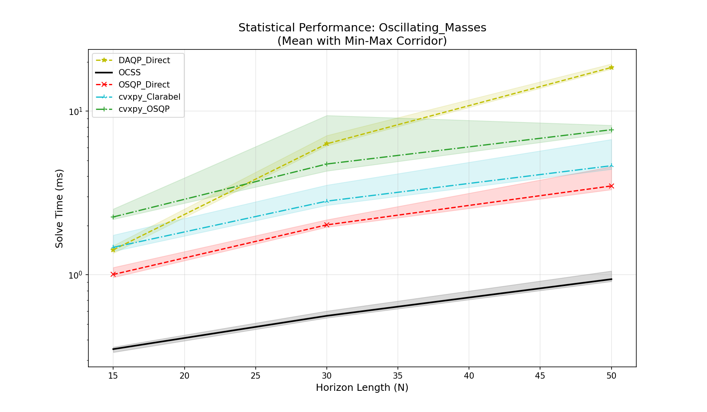
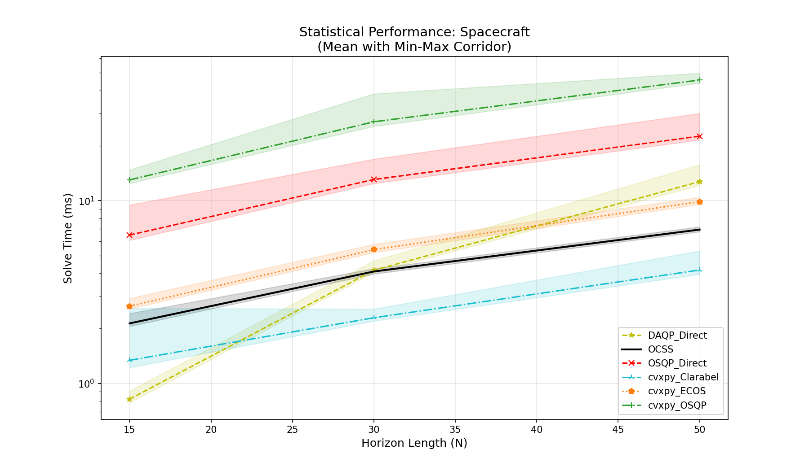
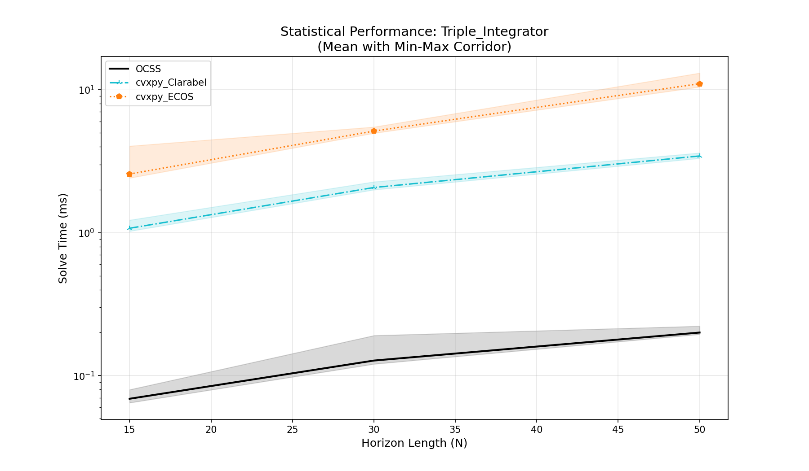

# OCSS
Optimal Control Splitting Solver is a Convex solver which currently supports Linear dynamics (LTI and LTV) and  box/ball constraints.

This repository contains a C++ optimal control splitting solver (OCSS) and a suite of Python benchmarks to compare its performance against `cvxpy`-based solvers (OSQP, Clarabel, ECOS) and DAQP.

## 1. Dependencies

### C++

-   **Eigen3**: Linear algebra library. 

If you are using mac, you can install it using `brew install eigen`

### Python
-   **Python 3.x**
-   `numpy`
-   `scipy`
-   `cvxpy`
-   `matplotlib`
-   `osqp` 
-   `clarabel`
-   `ecos` 
-   `daqp` 

To create a virtual environment and install Python dependencies:
```bash
python3 -m venv .venv
source .venv/bin/activate
pip install numpy scipy cvxpy matplotlib osqp clarabel ecos daqp
```

## 2. Compilation (C++)

To build the C++ solver and test suite:

```bash
mkdir -p build
cd build
cmake ..
make -j4
cd ..
```

This generates the executable:

-   `test_suite`: The main C++ benchmark runner.

## 3. Running Benchmarks

The benchmarks are split into C++ (for OCSS performance) and Python (for reference solvers).

### Step 1: Run C++ Benchmarks
This runs the OCSS solver for all problems and horizons N={15, 30, 50}, saving results to `simulation_results/`.

```bash
./build/test_suite
```

### Step 2: Run Python Benchmarks
This runs the reference solvers (OSQP, Clarabel, ECOS, DAQP) via `cvxpy` or direct python bindings.

```bash
source .venv/bin/activate
python python_benchmarks/run_benchmarks.py
```

### Step 3: Generate Plots
This script reads all CSV files in `simulation_results/` and generates plots in `figures/`.

```bash
python plot_benchmark_results.py
```

It generates:
-   **Trajectory Plots**: `Traj_{Problem}_N{N}.png` (Comparing state/input trajectories of all solvers)
-   **Performance Plots**: `Performance_{Problem}.png` (Scaling of solve time vs Horizon N)


## 4. Benchmark Problems

### A. Linear Quadrotor
This problem involves stabilizing a quadrotor drone around a hovering position.
-   **System**: The model has 12 states and 4 control inputs 
-   **Constraints**: Linear constraints.


### B. Oscillating Masses
This benchmark models a chain of 4 masses connected by springs and dampers, with the ends fixed to walls.
-   **System**: The model has 8 states and 4 control inputs
-   **Constraints**: Linear constraints.



### C. Spacecraft Rendezvous (HCW)
A chaser spacecraft performing a rendezvous maneuver with a target spacecraft in a circular orbit, modeled using the linearized Hill-Clohessy-Wiltshire (HCW) equations.
-   **System**: The model has 6 states and 3 inputs
-   **Constraints**: Linear constraints.




### D. Triple Integrator (3D)
A high-order control problem where we control the "jerk" (derivative of acceleration) of a point mass in 3D space.
-   **System**: The 9 states and 3 inputs represent the jerk along each axis.
-   **Constraints**: Linear constraints and Norm constraints (SOC).


